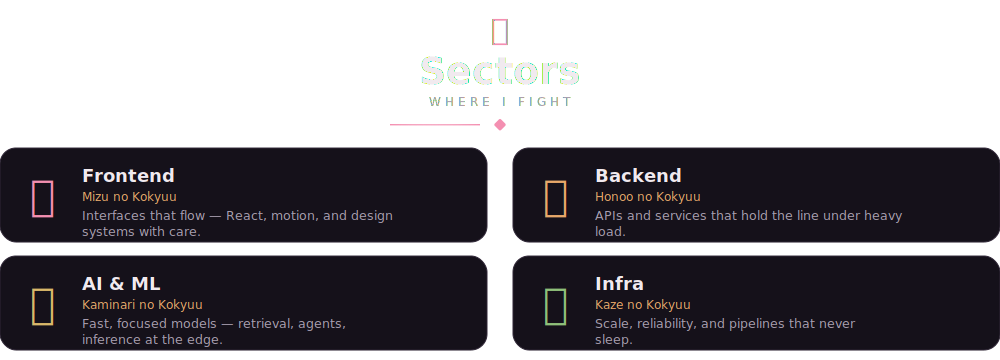
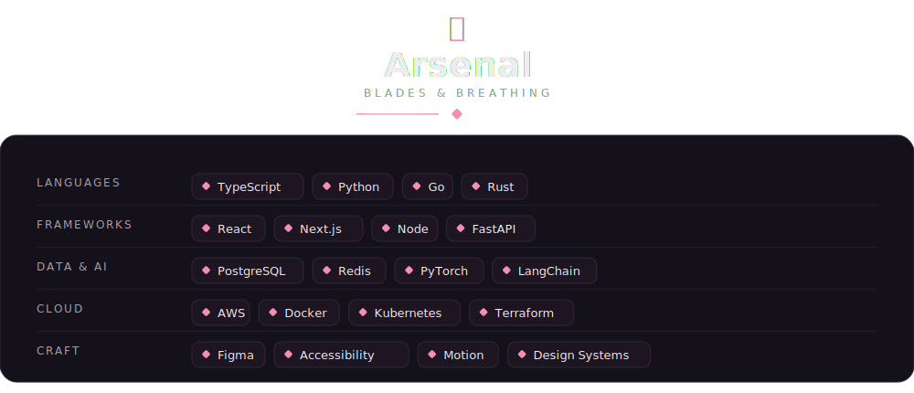
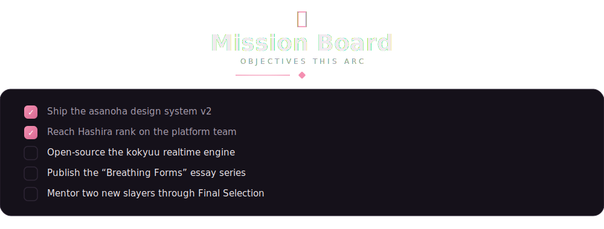

<!--
  ===================================================================
  Dearie Eburu — GitHub Profile README  (Demon Slayer / wisteria theme)
  -------------------------------------------------------------------
  To use: create a public repo named exactly after your GitHub username,
  drop this README.md and the /assets folder at its root, then commit.
  GitHub renders the /assets SVGs (with their CSS animation: falling
  sakura, swaying wisteria, flame, EQ bars) via its camo proxy.

  TODO before you ship — search "TODO:" below:
    • GitHub username  (placeholders use "dearie")
    • LinkedIn / X handles + email
  Telemetry + Word of the Day refresh DAILY via GitHub Actions
  (.github/workflows/daily-quote.yml): the proverb rotates and the stats
  (stars / commits / PRs / issues / reviews / top languages / streak /
  activity) are fetched LIVE from the GitHub API. Set GH_USER in that
  workflow to the real username and enable Actions. Until then telemetry
  shows placeholder numbers.
  ===================================================================
-->

<!-- ============================ HERO ============================ -->

<!-- TODO: replace "dearie" with your real GitHub username -->

<!-- ============================ ABOUT ============================ -->

<!-- ============================ SECTORS ============================ -->

<!-- ============================ ARSENAL ============================ -->

<!-- ======================= INTERMISSION ======================= -->

<!-- ============================ TELEMETRY ============================ -->

<!-- This card is rendered from LIVE GitHub data by the daily Action:
     stars / commits / PRs / issues / reviews / top languages (with real
     GitHub colors) / current streak / contribution activity, all fetched
     via GraphQL. Set GH_USER in the workflow to populate it. -->

<!-- ========================= MISSION BOARD ========================= -->

<!-- ========================= CROW RADIO ========================= -->
<!-- Animated now-playing card; clicking opens the track on Spotify.
     Swap the href for any track/playlist/album URL you like. -->

<!-- ====================== WORD OF THE DAY ====================== -->
<!-- assets/quote.svg is regenerated every day by
     .github/workflows/daily-quote.yml — a new Japanese proverb each day.
     Just enable Actions on the repo (Settings ▸ Actions ▸ Allow). -->

<!-- ============================ CONNECT ============================ -->

<!-- TODO: replace handles + email with your real ones -->

<!-- ============================ FOOTER ============================ -->

